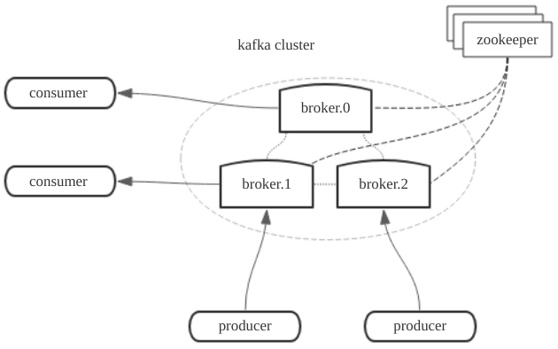
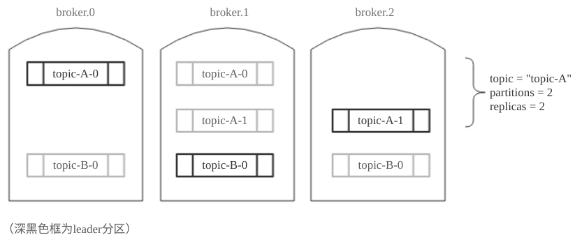
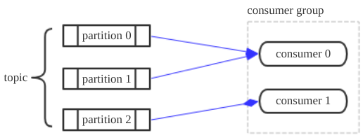
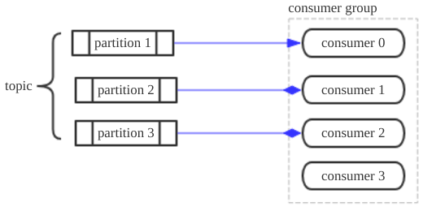

## 1. 分布式 ##

kafka以集群方式运行，包含一个或多个broker（或者说是kafka server） 。

## 2. Topic ##

kafka broker中将消息按topic为分类进行归纳。

生产者发送消息时、消费者接收消息时都应该指定消息的topic属性。

### 2.1 topic、分区与消息 ###

kafka将每个topic分类下的消息分为一个或多个分区，每个分区存储了一系列顺序编号(`offset`)的、不可改变的记录（`Record`）。

记录可以设置生存时间，在这个时间内记录一直存在。消费者自己保存下一个待消费消息的offset，通过指定offset编号来访问分区内的消息。

每个topic的分区对应kafka broker上的一个目录。比如名为为`test`的topic有两个分区，那么就对应`test-0`、`test-1`两个目录。分区的消息不断追加到对应目录的日志文件中。

### 2.2 topic分区副本 ###

关于topic分区有以下性质：

- 一个分区在不同的broker上存在副本，副本数(replication factor)由客户端创建时指定。
- 在一个分区的所有副本里，有一个副本作为主分区（leader），其它副本称为副本分区（follower）。
- 主分区才会处理对该分区的读写请求，其它次要分区只复制与它保持一致。
- 当主分区所在broker崩溃，其它的副本分区就会选举一个作为主分区。

### 2.3 消息的格式 ###

kafka的消息存储格式在不同版本中具体格式不同，但是消息总体可以分为消息头、键、值。其中键和值都是字节数组形式，即可以是任意二进制数据。

参考：http://kafka.apache.org/documentation/#messages

## 3. 消费者 ##

### 3.1 消费者组 ###

每个消费者属于一个消费者组(Consumer Group)，每条消息会被发送到所有订阅它的消费者组。而同一个消费者组内的消费者是竞争消息的，一条消息只可能被一个消费者消费。

1. 当topic下分区个数比消费者组内消费者个数多时，如下图所示。1个消费者可能同时获取多个分区的消息。

2. 当topic下分区个数比消费者组内消费者个数少时，如下图所示。每个消费者只能获得1个分区的消息，有些消费者获取不到消息（但是它们能正常连接broker）。

   

3. 当topic下分区数与消费者组内的消费者个数一样多时，就会刚好1个分区对应1个消费者。

测试发现，新的消费者加入一个消费者组，会导致topic下的分区与消费者们重新建立对应关系（原来能收到消息的消费者可能被顶掉，收不到消息）。

### 3.2 pull方式获取消息 ###

消费者与broker保持连接，并定时地向broker请求消息，这称为pull。消费者可以设置参数，使得pull消息操作一直阻塞，直到有数据到达，或者数据积累到一定量。

消费者应该在pull请求中设置要获取哪个分区的消息以及offset，从日志分区的指定位置开始读取。kafka允许从前面重新开始获取消费过的消息，因为kafka broker并不记录消费者消费了哪些消息。

## 4. 生产者 ##

生产者向kafka集群发送消息时，应该指定消息的topic、哪个分区。发送完成后，会收到kafka broker返回的关于该消息的offset。

### 4.1 请求的负载均衡 ###

生产者是直接发送数据到topic的leader分区所在服务器，中间不需要任何路由转发（看向RabbitMQ）。

Kafka集群所有节点（broker）都可以响应生产者的请求，如果请求的leader分区不在当前节点，那么它将告诉消费者正确的节点地址，消费者就可以重定向过去。